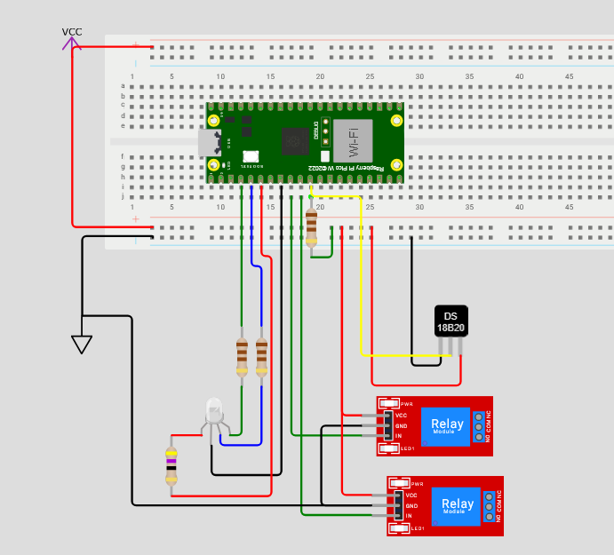
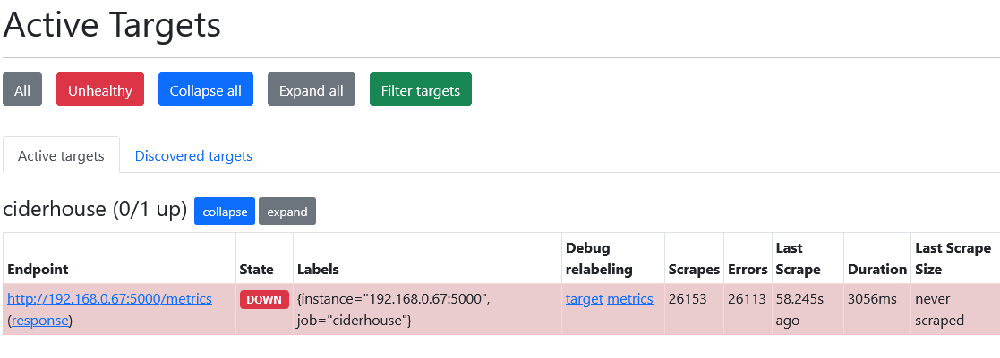

# A rudimentary control-system for home brewing

When I brewed beer some fifteen or more years ago, I was working with far more rudimentary tools than are available now.  Microcontrolers were strange things that ran custom code (if anything) and their utility
was obscure to a luddite like me.  I have some basic electronics knowledge but still don't really understand things like op-amps and the other modern 
paraphernalia of the trade, so anything I did would be pretty limited.   Therefore, I resorted to analogue methods and regulated the temperature of my wort by running water through it using an aquarium pump and some PVC tubing.
Crude but effective.

These days, things are much simpler - general purpose computers exist and are available in the form factor of a compact disk container (that's approximately 20cm x 20cm for those of you who are too young to know what a CD is).

I decided quite early on that I wanted to build an automated control system for any brewing vessel I used.  Firstly, because its' cool, and secondly
because I'm lazy and don't want to have to walk downstairs multiple times a day to check temperatures.  This is meant to be fun, not a job.
So I needed a programmable controller of some sort.

I possess an Arduino Nano which I bought as part of a previous (abandoned) project to build a computerised equatorial drive for a telescope.   
It was a fun little toy, but two things hindered my intent to repurpose it for this project:

1. It didn't have enough output pins to do what I suspected I wanted to do, and more importantly:
2. I couldn't find it.

So I cursed a bit, did some requirements-gathering and went shopping.

#### Requirements for the control system

1.  Must have sufficient GPIO pins to be able to drive / interface with several devices, namely:
    1. Some sort of on-board temperature indicator, likely an LED
    2. Relays for a heating circuit and a separate cooling circuit
    3. A waterproof thermometer that I intended to immerse in my fermentation vessel for direct temperature tracking 
2. Must preferably not require me to write C++
3. Some sort of WiFi or Bluetooth connectivity would be fantastic from a remote monitoring point of view.

At the very top of the list was the Rasberry Pi Pico W.  It spoke C++ (boo) and Python (another, smaller boo) which meant I'd conceivably be able to program it without  a Ph.D,
and it was a very small form factor.

So I bought it.

#### Hardware

First of all, I wanted a digital thermometer that I could put into the fermentation vessel.  I initially looked at using a [Thermowell](https://en.wikipedia.org/wiki/Thermowell), but these
are expensive and seem a little self-indulgent for a 5 litre fermentation vessel.  So I did some searching on PiHut and found what I wanted in the [DS18B20](https://thepihut.com/products/waterproof-ds18b20-digital-temperature-sensor-extras?srsltid=AfmBOopj4YG-kSlCmCX16z3JmvaJYnVBC-36X4jaRMKdsdNXNolsTzhG) waterproof digital thermometer.

I was originally going to drive an array of LEDS (red, amber and green) to indicate whether the stock was at the correct temperature or not.  However, in my cheap 
bunch of electronic parts that I'd bought previously, I found a RGB LED and decided to use it instead.  So that gave me temperature and a way to show the range visually; I settled on five colours: red, amber, green, cyan and blue ranging from far too hot to far too cold.  My intent was to have this LED taped somewhere visible so that a quick glance would show the status of the reaction.

I realised that I would need some way to programatically control heating and cooling, so I also bought a [dual-channel relay HAT](https://thepihut.com/products/dual-channel-relay-hat-for-raspberry-pi-pico) for the pico.  One Relay would drive the heating circuit which would be a brewing heat pad of some sort,
the other would drive whatever cooling system I eventually decided to make use of.  Given that I intend to start fermentation in late summer, my hope is that cooling will be less necessary as the reaction goes on.

After some tinkering, I had a basic control system mocked up.  I had one or two learning experiences, namely that I naively thought the thermometer would give analogue readings despite it clearly being described as a digital thermometer,
and an amusing time during which I tried to decode the pins of the RGB LED with my multimeter in diode mode.   Sigh.

Ultimately, though, I had a working circuit, and the software to drive it.  With the help of the excellent [Pico W Pinout diagram](https://datasheets.raspberrypi.com/picow/PicoW-A4-Pinout.pdf) I did some soldering and managed not to destroy anything expensive.

#### Software

The Pico drives the RGB LED through pins `GP2`, `GP3` and `GP4`.  `GP8` is used for the digital temperature sensor, and needs to be raised to +VCC via a pull-up resistor.
`GP6` is the cooling relay and `GP7` is the heating relay.

The control system is simple.  A set of ranges are defined, and actions are taken based on where in the range the temperature reading falls.
Essentially, if the thermometer reads below the "green" zone, the heating relay is turned on until temperature returns to the green zone.  If the 
temperature is above the green zone, the cooling circuit is turned on.  Nice and simple.   

For visual checks I added five hues via the RGB LED - these are blue (way too cold), cyan (below ideal), green (ideal), amber (above ideal) and red (way too hot).
A test routine at power on verifies that these are all functional.

However, because I'm lazy, I also wanted to spool metrics to an observability platform.  I have a little Lenovo Thinkcenter which runs Linux Mint.  It's a db server, a mumble server and does a couple of other things - like running [VictoriaMetrics](https://victoriametrics.com/) which remains the best timeseries system I've worked with from an SRE point of view.

So I did some research and found the [microdot](https://microdot.readthedocs.io/en/latest/) webserver, which seemed perfect to allow my Pico W to expose metrics.

#### Instrumentation

It's probably easiest to just dump the format string here:

    # HELP {appname}_led_status Status gauge for pico onboard led
    # TYPE {appname}_led_status gauge
    {appname}_led_status{{led="LED"}} {machine.Pin("LED", mode=machine.Pin.OUT).value()}
    {appname}_led_status{{led="RED",pin="{monitor.LED_PIN_RED}"}} {machine.Pin(monitor.LED_PIN_RED, mode=machine.Pin.OUT).value()}
    {appname}_led_status{{led="GREEN",pin="{monitor.LED_PIN_GREEN}"}} {machine.Pin(monitor.LED_PIN_GREEN, mode=machine.Pin.OUT).value()}
    {appname}_led_status{{led="BLUE",pin="{monitor.LED_PIN_BLUE}"}} {machine.Pin(monitor.LED_PIN_BLUE, mode=machine.Pin.OUT).value()}
    
    # HELP {appname}_sensor_temperature Temperature gauge for DS18B20 sensor which should be in the fermentation vessel
    # TYPE {appname}_sensor_temperature gauge
    {appname}_sensor_temperature{{type="digital",model="ds18b20",pin="{monitor.TEMPERATURE_IN}"}} {monitor.last}
    
    # HELP {appname}_relay_state State of a relay on the fermentation chamber control circuit
    # TYPE {appname}_relay_state gauge
    {appname}_relay_state{{model="{relaytype}",pin="{monitor.COOLING_RELAY}"}} {machine.Pin(monitor.COOLING_RELAY, mode=machine.Pin.OUT).value()}
    {appname}_relay_state{{model="{relaytype}",pin="{monitor.HEATING_RELAY}"}} {machine.Pin(monitor.HEATING_RELAY, mode=machine.Pin.OUT).value()}

And there we go. The pico is scraped on port 5000 and ships metrics (when it's plugged in)

